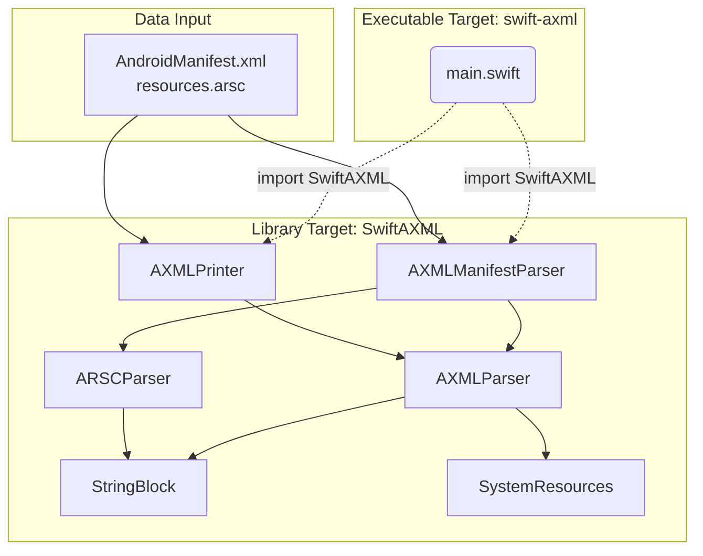
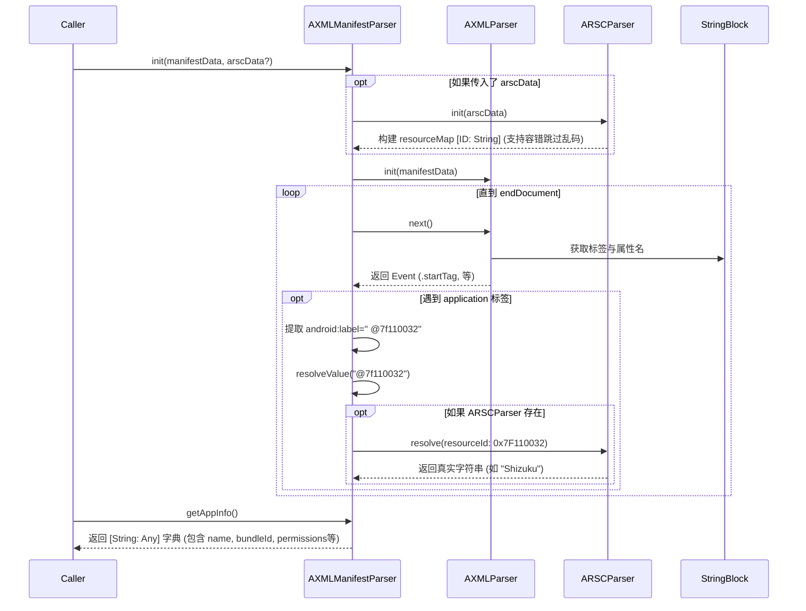

# SwiftAXML 项目重构与解析原理总结

本文档详尽记录了 `SwiftAXML` 项目从一个无法正常解析二进制 XML 的半成品，重构为一个高度健壮、可作为 Swift Package 被外部引用的高质量解析库的全过程。

## 1. 项目背景与目标

Android 系统为了优化存储空间和提升解析速度，在 APK 编译时会将明文的 `AndroidManifest.xml` 以及其他资源 XML 文件编译为二进制的 `AXML` (Android Binary XML) 格式。同时，各种字符串、颜色等资源会被集中编译在 `resources.arsc` 资源映射表中。

本项目 `SwiftAXML` 的目标是：
1. **完全基于 Swift 原生实现**：不依赖任何外部 C/C++ 库或 Python 运行时，直接在 iOS、macOS 和 Linux 环境中解析 `AXML` 和 `ARSC`。
2. **提供底层与高层双重 API**：
    - **底层 API (`AXMLPrinter`)**: 还原原始的明文 XML 结构。
    - **高层 API (`AXMLManifestParser`)**: 面向业务场景（如应用商店、逆向工程），直接提取 `bundleIdentifier`、`version`、`permissions` 等核心 App Metadata 信息。
3. **极高的健壮性**：即使面对经过混淆或加固的、不完全符合标准的 Android 资源文件，也能尽可能多地提取有效信息而不会导致程序崩溃。

---

## 2. 核心问题与修复过程记录

在重构初期，`SwiftAXML` 的旧版代码在解析标准的 `AndroidManifest.xml` 时输出了极度错乱的 XML（如标签未闭合、属性名变为命名空间 URL、甚至出现数组越界崩溃）。经过深度对比 Python 版本的 `axml` 解析器，我们定位并修复了以下四个致命问题：

### 问题一：命名空间与前缀映射丢失
**现象**：`AXMLPrinter` 在遇到 `namespace` 时，直接输出了全称的 URL 作为前缀（例如 `http://schemas.android.com/apk/res/android:versionCode`），这不仅不合法，而且可读性极差。
**修复**：在 `AXMLParser` 解析 `START_NAMESPACE_TYPE` 块时，记录 `namespaceUriPrefixMap`（保存 URL 到 `android` 前缀的映射）。在输出标签和属性时，通过查表反向使用短前缀。并在根标签自动补全 `xmlns:android="..."` 声明。

### 问题二：系统属性名资源丢失 (`resourceMap`)
**现象**：像 `android:name` 这样的属性被解析成了空字符串或错乱的值。
**原因**：Android 编译时会将常用的系统属性（如 `versionCode`, `name`）的名称从字符串池中移除，替换为一个 32 位的资源 ID（存放在 `RES_XML_RESOURCE_MAP_TYPE` 块中）。原 Swift 代码在解析属性名时，仅去字符串池 (`StringBlock`) 查找，没有查询系统属性 ID 映射表。
**修复**：
1. 利用 Python 工程中的 `public.xml` 生成了原生的 Swift 字典源文件 `SystemResources.swift`。
2. 在 `AXMLParser` 中，若属性名指向了 `resourceMap`，则优先从 `SystemResources` 中根据 ID 获取其真实名称（如 `0x01010003` 对应 `name`）。

### 问题三：AXML 节点 Header 字节偏移计算错误（致命崩溃）
**现象**：在读取属性字段时频繁出现 `UnsafeRawBufferPointer.load out of bounds` 崩溃。
**原因**：在 AXML 格式中，普通的 `ResChunk_header` 大小是 8 字节。但在 `RES_XML_START_ELEMENT_TYPE` 等树形节点区块中，头部实际上是一个 `ResXMLTree_node`（16 字节，包含了额外的 `lineNumber` 和 `commentIndex`）。原代码错误地使用 `cursor + 8` 跳过头部，导致后续读取所有属性（如 `nsIndex`, `nameIndex`, `attributeCount`）的字节偏移全部错位 8 个字节！
**修复**：废弃硬编码的 8 字节，动态使用 `cursor + Int(header.headerSize)` 进行对齐计算，成功恢复了正确的读取指针。

### 问题四：UInt32 无符号转换导致的 0xFFFFFFFF 越界
**现象**：属性值为占位符 `-1` (`0xFFFFFFFF`) 时，Swift 中转为 `Int` 后变成正数 `4294967295`，导致去 `StringBlock` 取字符串时发生越界崩溃。
**修复**：在所有 `UInt32` 转换为 `Int` 的地方，显式拦截 `== 0xFFFFFFFF` 的情况并赋值为 `nil` 或忽略，避免向字符串池请求非法索引。

---

## 3. 架构设计与扩展

重构后的 `SwiftAXML` 被设计为一个标准的 Swift Package (Library)，结构如下：

### 3.1 模块架构图



### 3.2 核心类说明
1. **`AXMLParser` (底层状态机)**：负责逐块 (Chunk by Chunk) 解析二进制 `AXML` 文件流。暴露一个 `next()` 方法，不断返回 `.startTag`, `.endTag`, `.text` 等 `Event`，并对外提供当前游标下的标签名和属性。
2. **`AXMLPrinter` (逆向还原)**：驱动 `AXMLParser`，将其返回的状态重新拼接为标准的可读 `XML` 字符串。
3. **`AXMLManifestParser` (高层数据提取)**：在不需要拼接 XML 文本的情况下，驱动 `AXMLParser` 在内存中构建结构化的 App 元数据字典（如提取 App 版本、全量权限列表、Activities、Services 列表等）。
4. **`ARSCParser` (资源映射解析)**：解析 Android 的 `resources.arsc` 文件。主要功能是提供一个 `resolve(resourceId:)` 方法，将 `AndroidManifest` 中形如 `@7f110032` 的资源 ID，还原为对应语言环境下的真实字符串。

---

## 4. 解析与资源还原流程

以 `AXMLManifestParser` 提取应用名并配合 `ARSCParser` 还原为例，其流程如下：



**关于 ARSC 解析的极高防崩溃容错（Resilience）**：
Android 恶意软件或加固工具经常故意破坏 `ARSC` 的文件头结构（例如塞入非标准的 ChunkType `46960`），导致按字节严格遍历的解析器崩溃。为了应对这种情况，`ARSCParser` 在设计时加入了全域的 `do-catch` 拦截：一旦遇到无法识别的块，立刻终止 ARSC 解析，但**绝不崩溃**，已成功解析的资源映射依然可用，且后续的 XML 解析能够顺利继续（无法解析的值将以 `@7f...` 的形式原样保留）。

---

## 5. 项目使用方式 (API & CLI)

### 5.1 作为 Swift Package 库使用
在您的 `Package.swift` 中引入后：
```swift
import SwiftAXML
import Foundation

let manifestData = try Data(contentsOf: URL(fileURLWithPath: "AndroidManifest.xml"))
let arscData = try? Data(contentsOf: URL(fileURLWithPath: "resources.arsc"))

// 支持纯 Manifest 解析，也支持联合 ARSC 进行资源名称的自动还原
let parser = try AXMLManifestParser(data: manifestData, arscData: arscData)
let appInfo = parser.getAppInfo()

// 基础属性
print(appInfo["bundleIdentifier"] as? String ?? "") 
print(appInfo["version"] as? String ?? "")          
print(appInfo["permissions"] as? [String] ?? [])

// 高级节点全量提取
let activities = appInfo["activities"] as? [[String: String]] ?? []
for activity in activities {
    print(activity["name"] ?? "Unknown Activity")
}
```

### 5.2 作为命令行工具使用 (CLI)
通过终端进入项目目录，可以直接使用独立的命令行目标执行解析：
```bash
# 编译
swift build -c release

# 1. 还原 AXML 为明文并打印
swift run swift-axml axml /path/to/AndroidManifest.xml

# 2. 提取应用的高级字典与权限列表
# 格式: swift-axml info <manifest_path> [arsc_path]
swift run swift-axml info /path/to/AndroidManifest.xml /path/to/resources.arsc
```

---

## 6. 测试与 CI
通过引入 `Package.swift` 中的 `.copy("Data")` 资源配置机制，使得所有的测试用例（针对常规、带命名空间、混淆缺失等特征的样本文件）都可以跨平台（macOS / Linux）独立、稳定地通过 `swift test` 执行。确保了由于物理路径和运行目录不确定导致的 "File not found" 问题被彻底解决。
